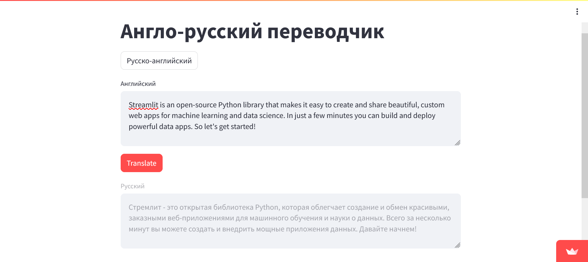

# Англо-русский переводчик.

Использованы две готовые модели для разных направлений перевода:
[Helsinki-NLP/opus-mt-en-ru](https://huggingface.co/Helsinki-NLP/opus-mt-en-ru)
и [Helsinki-NLP/opus-mt-ru-en](https://huggingface.co/Helsinki-NLP/opus-mt-ru-en)

Приложение можно использвать для перевода текста с английского на русский и с русского на английский.
Например для перевода документации или статьи с английского языка. Или для перевода текста с русского
на английския язык для написания документации на английском и для общения с англоязычным заказчиком.

Приложение опубликовано на Streamlit: https://en-ru-translate.streamlit.app/

Выполнил: Брылин Е.В.

Скриншот приложения.

