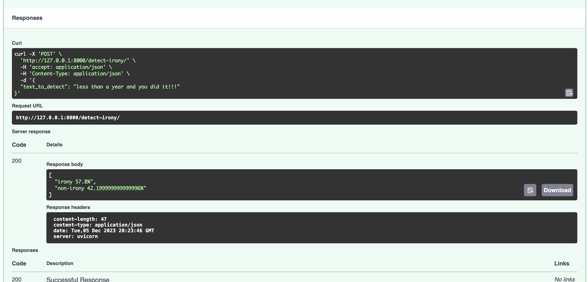

### Web сервис предоставляющий API "Обнаружение иронии в текстах"

## Endpoints:
 - "/detect-irony/" , 
    контракт:
     - request - { text_to_detect: "text bla bla" } 
     - response - [ score1, score2, ..., scoreN ]

## Структура проекта:
 - main.py - код приложения API - инфраструктура, контроллеры
 - irony_detector.py - модуль содержит класс инкапуслирующий логику взаимодействия с моделью

 ## Примеры вызова:
 
 

